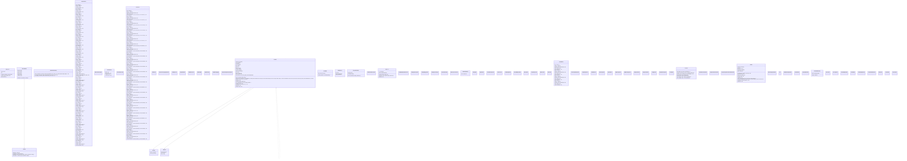

# Engine: scan checks

Generated by `scripts/gen-uml.sh` from `app/core/src/scan_checks`. Do not edit by hand.

```mermaid
classDiagram
    class Replay~S~ {
        -pre: Vec~u8~
        -io: S
        +read(out: &mut [u8]) Result~usize~
        +write(b: &[u8]) Result~usize~
        +flush() Result~()~
    }
    class Override {
        +label(self) &'static str
        +names(self) &'static [&'static str]
        +probe(self, canary: &str, base_status: u16) Vec~(&'static str, String)~
        +control(self, cx: &ScanCtx) Vec~(&'static str, String)~
    }
    class OverrideProbe {
        -kind: Override
        -canary: String
        -buster: String
        -headers: Vec~(&'static str, String)~
        -req: Vec~u8~
        -resp: Vec~u8~
        -reflected: bool
    }
    class WebCachePoisoning {
        +report_override(cx: &ScanCtx, probe: &OverrideProbe, base_status: u16, control: Option~(&[u8], &[u8])~) void
        +try_poison(cx: &ScanCtx, probe: &OverrideProbe, base_status: u16) bool
        +run_family(cx: &ScanCtx, kind: Override, base_status: u16) void
    }
    class RequestCheck {
        +id() &'static str
        +issue() &'static str
        +scope() Scope
        +run(cx: &ScanCtx) void
        +id() &'static str
        +issue() &'static str
        +scope() Scope
        +run(cx: &ScanCtx) void
    }
    class WebCacheDeception {
    }
    class Assessed~'a~ {
        +status: u16
        +body: Cow~'a, [u8]~
        +complete: bool
        +content_type: String
    }
    class ExternalInteraction {
    }
    class PointCheck {
        +id() &'static str
        +issue() &'static str
        +applies_to(ip: &InsertionPoint) bool
        +server_side() bool
        +run(cx: &ScanCtx, st: &mut ScanState, pt: &mut PointRun) void
        +id() &'static str
        +issue() &'static str
        +applies_to(ip: &InsertionPoint) bool
        +server_side() bool
        +run(cx: &ScanCtx, st: &mut ScanState, pt: &mut PointRun) void
        +id() &'static str
        +issue() &'static str
        +applies_to(ip: &InsertionPoint) bool
        +server_side() bool
        +run(cx: &ScanCtx, _st: &mut ScanState, pt: &mut PointRun) void
        +id() &'static str
        +issue() &'static str
        +applies_to(ip: &InsertionPoint) bool
        +server_side() bool
        +run(cx: &ScanCtx, _st: &mut ScanState, pt: &mut PointRun) void
        +id() &'static str
        +issue() &'static str
        +applies_to(ip: &InsertionPoint) bool
        +server_side() bool
        +run(cx: &ScanCtx, _st: &mut ScanState, pt: &mut PointRun) void
    }
    class JwtAttacks {
    }
    class ExpressionLanguageInjection {
    }
    class XPathInjection {
    }
    class HttpPutEnabled {
    }
    class RequestCheck {
        +id() &'static str
        +issue() &'static str
        +scope() Scope
        +run(cx: &ScanCtx) void
        +id() &'static str
        +issue() &'static str
        +scope() Scope
        +run(cx: &ScanCtx) void
        +id() &'static str
        +issue() &'static str
        +scope() Scope
        +run(cx: &ScanCtx) void
        +id() &'static str
        +issue() &'static str
        +scope() Scope
        +run(cx: &ScanCtx) void
        +id() &'static str
        +issue() &'static str
        +scope() Scope
        +run(cx: &ScanCtx) void
    }
    class JwkSetDisclosed {
    }
    class HiddenHttp2 {
    }
    class AspNetTracing {
    }
    class AspNetDebugging {
    }
    class SuspiciousInputTransformation {
    }
    class Settings {
        +speed: ScanSpeed
        +accuracy: Accuracy
    }
    class Baseline {
        +resp: Option~Vec<u8>~
        +raw: Vec~u8~
        +body: String
    }
    class ScanCtx {
        +shared: Arc~Shared~
        +entry: HistEntry
        +req: String
        +parts: HttpParts
        +host: String
        +port: u16
        +host_hdr: String
        +settings: Settings
        +baseline: Baseline
        +oob: Vec~(String, String, String)~
        +smtp: Vec~SmtpOob~
        +item: usize
        +stored_report: bool
        +http2_enabled: bool
        -host_scope: Arc~crate::host_probe_state::AttemptScope~
        +start(shared: Arc~Shared~, entry: HistEntry, req: String, parts: HttpParts, host: String, port: u16, settings: Settings, oob: Vec~(String, String, String)~, smtp: Vec~SmtpOob~, item: usize, host_scope: Arc~crate::host_probe_state::AttemptScope~) ScanCtx
        +state() Arc~crate::scan::ScanDedup~
        +stopped() bool
        +send(raw: &[u8]) Option~Vec<u8>~
        +send_following(raw: &str) Vec~(String, Option<Vec<u8>>)~
        +runs(issue: &str) bool
        +report(issues: Vec~ScanIssue~) void
        +progress() void
        +pace(ms: u64) void
    }
    class ScanState {
        +stored_markers: Vec~(String, String)~
        +oob_used: Vec~usize~
    }
    class PointRun~'a~ {
        +idx: usize
        +ip: &'a InsertionPoint
        +sqli_reported: bool
    }
    class EverywhereProbe {
        +request: String
        +sni: Option~String~
        +ids: Vec~(&'static str, String, &'static str)~
    }
    class CollaboratorEverywhere {
    }
    class RequestCheck {
        +id() &'static str
        +issue() &'static str
        +scope() Scope
        +run(cx: &ScanCtx) void
    }
    class Helper~'a~ {
        -cx: &'a ScanCtx
        -points: &'a [InsertionPoint]
        +send(req: &[u8]) Option~Vec<u8>~
        +build(point: usize, payload: &[u8]) Option~Vec<u8>~
        +stopped() bool
    }
    class GraphqlEndpointDiscovered {
    }
    class RequestCheck {
        +id() &'static str
        +issue() &'static str
        +scope() Scope
        +run(cx: &ScanCtx) void
        +id() &'static str
        +issue() &'static str
        +scope() Scope
        +run(cx: &ScanCtx) void
        +id() &'static str
        +issue() &'static str
        +scope() Scope
        +run(cx: &ScanCtx) void
        +id() &'static str
        +issue() &'static str
        +scope() Scope
        +run(cx: &ScanCtx) void
        +id() &'static str
        +issue() &'static str
        +scope() Scope
        +run(cx: &ScanCtx) void
        +id() &'static str
        +issue() &'static str
        +scope() Scope
        +run(cx: &ScanCtx) void
        +id() &'static str
        +issue() &'static str
        +scope() Scope
        +run(cx: &ScanCtx) void
        +id() &'static str
        +issue() &'static str
        +scope() Scope
        +run(cx: &ScanCtx) void
    }
    class GraphqlIntrospection {
    }
    class GraphqlSuggestions {
    }
    class GraphqlContentType {
    }
    class SpoofableClientIp {
    }
    class BrokenAccessControl {
    }
    class HeaderDependent {
        +user_agent: bool
    }
    class BackupFile {
    }
    class LightProbes {
    }
    class PointCheck {
        +id() &'static str
        +issue() &'static str
        +applies_to(ip: &InsertionPoint) bool
        +server_side() bool
        +run(cx: &ScanCtx, st: &mut ScanState, pt: &mut PointRun) void
        +id() &'static str
        +issue() &'static str
        +applies_to(ip: &InsertionPoint) bool
        +server_side() bool
        +run(cx: &ScanCtx, st: &mut ScanState, pt: &mut PointRun) void
        +id() &'static str
        +issue() &'static str
        +applies_to(ip: &InsertionPoint) bool
        +server_side() bool
        +run(cx: &ScanCtx, _st: &mut ScanState, pt: &mut PointRun) void
        +id() &'static str
        +issue() &'static str
        +applies_to(ip: &InsertionPoint) bool
        +server_side() bool
        +run(cx: &ScanCtx, _st: &mut ScanState, pt: &mut PointRun) void
        +id() &'static str
        +issue() &'static str
        +applies_to(ip: &InsertionPoint) bool
        +server_side() bool
        +run(cx: &ScanCtx, _st: &mut ScanState, pt: &mut PointRun) void
        +id() &'static str
        +issue() &'static str
        +applies_to(ip: &InsertionPoint) bool
        +server_side() bool
        +run(cx: &ScanCtx, _st: &mut ScanState, pt: &mut PointRun) void
        +id() &'static str
        +issue() &'static str
        +applies_to(ip: &InsertionPoint) bool
        +server_side() bool
        +run(cx: &ScanCtx, _st: &mut ScanState, pt: &mut PointRun) void
        +id() &'static str
        +issue() &'static str
        +applies_to(ip: &InsertionPoint) bool
        +server_side() bool
        +run(cx: &ScanCtx, _st: &mut ScanState, pt: &mut PointRun) void
        +id() &'static str
        +issue() &'static str
        +applies_to(ip: &InsertionPoint) bool
        +server_side() bool
        +run(cx: &ScanCtx, _st: &mut ScanState, pt: &mut PointRun) void
        +id() &'static str
        +issue() &'static str
        +applies_to(ip: &InsertionPoint) bool
        +server_side() bool
        +run(cx: &ScanCtx, st: &mut ScanState, pt: &mut PointRun) void
        +id() &'static str
        +issue() &'static str
        +applies_to(ip: &InsertionPoint) bool
        +server_side() bool
        +run(cx: &ScanCtx, _st: &mut ScanState, pt: &mut PointRun) void
        +id() &'static str
        +issue() &'static str
        +applies_to(ip: &InsertionPoint) bool
        +server_side() bool
        +run(cx: &ScanCtx, _st: &mut ScanState, pt: &mut PointRun) void
        +id() &'static str
        +issue() &'static str
        +applies_to(ip: &InsertionPoint) bool
        +server_side() bool
        +run(cx: &ScanCtx, _st: &mut ScanState, pt: &mut PointRun) void
        +id() &'static str
        +issue() &'static str
        +applies_to(ip: &InsertionPoint) bool
        +server_side() bool
        +run(cx: &ScanCtx, _st: &mut ScanState, pt: &mut PointRun) void
        +id() &'static str
        +issue() &'static str
        +applies_to(ip: &InsertionPoint) bool
        +server_side() bool
        +run(cx: &ScanCtx, _st: &mut ScanState, pt: &mut PointRun) void
        +id() &'static str
        +issue() &'static str
        +applies_to(ip: &InsertionPoint) bool
        +server_side() bool
        +run(cx: &ScanCtx, st: &mut ScanState, pt: &mut PointRun) void
        +id() &'static str
        +issue() &'static str
        +applies_to(ip: &InsertionPoint) bool
        +server_side() bool
        +run(cx: &ScanCtx, _st: &mut ScanState, pt: &mut PointRun) void
        +id() &'static str
        +issue() &'static str
        +applies_to(ip: &InsertionPoint) bool
        +server_side() bool
        +run(cx: &ScanCtx, _st: &mut ScanState, pt: &mut PointRun) void
        +id() &'static str
        +issue() &'static str
        +applies_to(ip: &InsertionPoint) bool
        +server_side() bool
        +run(cx: &ScanCtx, _st: &mut ScanState, pt: &mut PointRun) void
        +id() &'static str
        +issue() &'static str
        +applies_to(ip: &InsertionPoint) bool
        +server_side() bool
        +run(cx: &ScanCtx, st: &mut ScanState, _pt: &mut PointRun) void
    }
    class OsCommandInjection {
    }
    class PathTraversal {
    }
    class LinkManipulation {
    }
    class FilePathManipulation {
    }
    class SsiInjection {
    }
    class TemplateInjection {
    }
    class ReflectedXss {
    }
    class StoredXss {
    }
    class StoredCheck {
        +id() &'static str
        +issue() &'static str
        +applies_to(ip: &InsertionPoint) bool
        +server_side() bool
        +run(cx: &PairCtx) void
    }
    class ClientTemplateInjection {
    }
    class PhpCodeInjection {
    }
    class InputReflected {
    }
    class HeaderInjection {
    }
    class OpenRedirect {
    }
    class SqlErrorInjection {
    }
    class SqlBooleanInjection {
    }
    class XmlInjectionOob {
    }
    class XmlInjectionError {
    }
    class LdapInjection {
    }
    class SmtpHeaderInjection {
    }
    class StoredEcho {
    }
    class Recorder {
        -log: RefCell~Vec<(String, ScanEvidence)>~
        +send(cx: &ScanCtx, key: &str, raw: &[u8]) Option~Vec<u8>~
        +note(key: &str, raw: &[u8], resp: Option~&[u8]~) void
        +last_index(key: &str) Option~usize~
        +last(key: &str) Option~ScanEvidence~
        +next_after(key: &str) Option~ScanEvidence~
        +since_last(key: &str) Vec~ScanEvidence~
    }
    class OpenRedirectionStored {
    }
    class StoredCheck {
        +id() &'static str
        +issue() &'static str
        +applies_to(ip: &InsertionPoint) bool
        +server_side() bool
        +run(cx: &PairCtx) void
        +id() &'static str
        +issue() &'static str
        +applies_to(ip: &InsertionPoint) bool
        +server_side() bool
        +run(cx: &PairCtx) void
        +id() &'static str
        +issue() &'static str
        +applies_to(ip: &InsertionPoint) bool
        +server_side() bool
        +run(cx: &PairCtx) void
    }
    class SqlInjectionSecondOrder {
    }
    class SuspiciousInputTransformationStored {
    }
    class PairCtx {
        +shared: Arc~Shared~
        +pair: Pair
        -g11_hit: Cell~bool~
        -incomplete: Cell~bool~
        -partial: Cell~bool~
        +new(shared: Arc~Shared~, pair: Pair) Self
        +g11_allowed() bool
        +retrieval_is_safe() bool
        +note_g11_hit() void
        +stopped() bool
        +send_following(item: Item, raw: &str) Vec~(String, Option<Vec<u8>>)~
        +record_exchange(request: &[u8], response: Option~&[u8]~) Option~ScanEvidence~
        +report(issues: Vec~ScanIssue~) void
        +progress() void
    }
    class DomPrototypePollution {
    }
    class RequestCheck {
        +id() &'static str
        +issue() &'static str
        +scope() Scope
        +group() Option~&'static str~
        +consumes_cached_dom_after_stop() bool
        +run(cx: &ScanCtx) void
    }
    class Cors {
    }
    class RequestCheck {
        +id() &'static str
        +issue() &'static str
        +scope() Scope
        +group() Option~&'static str~
        +run(cx: &ScanCtx) void
        +id() &'static str
        +issue() &'static str
        +scope() Scope
        +group() Option~&'static str~
        +run(cx: &ScanCtx) void
        +id() &'static str
        +issue() &'static str
        +scope() Scope
        +group() Option~&'static str~
        +run(cx: &ScanCtx) void
        +id() &'static str
        +issue() &'static str
        +scope() Scope
        +group() Option~&'static str~
        +run(cx: &ScanCtx) void
        +id() &'static str
        +issue() &'static str
        +scope() Scope
        +group() Option~&'static str~
        +run(cx: &ScanCtx) void
        +id() &'static str
        +issue() &'static str
        +scope() Scope
        +group() Option~&'static str~
        +run(cx: &ScanCtx) void
        +id() &'static str
        +issue() &'static str
        +scope() Scope
        +group() Option~&'static str~
        +run(cx: &ScanCtx) void
        +id() &'static str
        +issue() &'static str
        +scope() Scope
        +run(cx: &ScanCtx) void
        +id() &'static str
        +issue() &'static str
        +scope() Scope
        +run(cx: &ScanCtx) void
        +id() &'static str
        +issue() &'static str
        +scope() Scope
        +group() Option~&'static str~
        +run(cx: &ScanCtx) void
        +id() &'static str
        +issue() &'static str
        +scope() Scope
        +run(cx: &ScanCtx) void
        +id() &'static str
        +issue() &'static str
        +scope() Scope
        +group() Option~&'static str~
        +run(cx: &ScanCtx) void
        +id() &'static str
        +issue() &'static str
        +scope() Scope
        +group() Option~&'static str~
        +run(cx: &ScanCtx) void
        +id() &'static str
        +issue() &'static str
        +scope() Scope
        +group() Option~&'static str~
        +run(cx: &ScanCtx) void
    }
    class PathRelativeStyleSheet {
    }
    class TraceEnabled {
    }
    class OpenApiDefinition {
    }
    class CrossDomainPolicy {
        +kind: CrossDomainKind
        +path() &'static str
    }
    class ServerTrace {
    }
    class ServerOptions {
    }
    class HeaderManipulation {
    }
    class XxeFileRead {
    }
    class XmlEntityExpansion {
    }
    class CsrfTokenNotEnforced {
    }
    class RobotsTxt {
    }
    class React2Shell {
    }
    class TlsCertificate {
    }
    OverrideProbe --> Override
    ScanCtx --> Settings
    ScanCtx --> Baseline
    ScanCtx ..> ScanCtx
```
