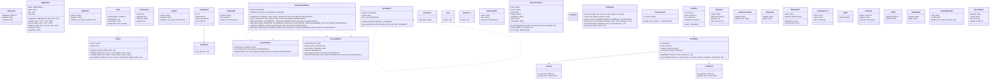

# Engine: scanner run, issues, crawl and audit

Generated by `scripts/gen-uml.sh` from `app/core/src/scan`. Do not edit by hand.

```mermaid
classDiagram
    class SqlErrorHit {
        +database: &'static str
        +payload: String
        +confirmed: bool
    }
    class SqlBoolGen {
        -shape: SqlBoolShape
        -quote: String
        -pos: usize
        -neg: usize
        +new(shape: SqlBoolShape, quote: &str) Self
        +render(r: u32, n: u32, v: &str) String
        +positive_with(r: u32, n: u32) String
        +negative_with(r: u32, m: u32, k: u32) String
        +positive() String
        +negative() String
    }
    class SqlBoolHit {
        +positive: String
        +negative: String
        +attributes: Vec~crate::variations::Attr~
    }
    class Needle {
        -bytes: Vec~u8~
        -entities: bool
        +new(bytes: &[u8], entities: bool) Self
        +find(hay: &[u8], from: usize, to: usize) Option~(usize, usize)~
        +scan(hay: &[u8], from: usize, to: usize) Option~(usize, usize)~
        +next_byte(hay: &[u8], pos: usize, to: isize, matched: isize) Option~(usize, u8)~
    }
    class Probe {
        +sequence(self) &'static str
        +decoded(self) u8
        +variant(self) usize
        +needle(self, s: &str) Needle
    }
    class TransformHit {
        +variant: u8
        +payload: String
        +reflection: String
        +append: bool
    }
    class LdapHit {
        +positive: String
        +negative: String
        +attributes: Vec~crate::variations::Attr~
    }
    class ScanSpeed {
        +from_u8(v: u8) Self
    }
    class TravPayload {
        -os: u8
        -placement: u8
        -speed: ScanSpeed
        -text: &'static str
    }
    class FileReadHit {
        +payload: String
        +file: &'static str
        +markers: Vec~&'static str~
    }
    class ExperimentalEngine {
        -shared: Arc~Shared~
        -coordinator: Arc~crate::scan_lifecycle::Coordinator~
        +new(shared: Arc~Shared~, limits: Limits) Result~Self, crate::scan_lifecycle::AdmissionError~
        +open() Result~crate::scan_lifecycle::Batch, crate::scan_lifecycle::AdmissionError~
        +audit_batch(entries: Vec~HistEntry~) Result~AcceptedBatch, crate::scan_lifecycle::AdmissionError~
        +audit_batch_before_finish(entries: Vec~HistEntry~, before_finish: impl FnOnce()) Result~AcceptedBatch, crate::scan_lifecycle::AdmissionError~
        +audit(entry: HistEntry) Result~AcceptedAudit, crate::scan_lifecycle::AdmissionError~
        +audit_after_admission(entry: HistEntry, admitted: impl FnOnce()) Result~AcceptedAudit, crate::scan_lifecycle::AdmissionError~
    }
    class AcceptedAudit {
        +audit_phase_completion: Finish
        +error: Option~crate::scan_lifecycle::AdmissionError~
        +handoff: Result~crate::scan_lifecycle::Handoff, crate::scan_lifecycle::AdmissionError~
    }
    class AcceptedBatch {
        +completed_items: usize
        +shared_owner_cancelled: bool
        +audit_phase_completion: Finish
        +outcome: BatchOutcome
        +error: Option~crate::scan_lifecycle::AdmissionError~
        +handoff: Result~crate::scan_lifecycle::Handoff, crate::scan_lifecycle::AdmissionError~
    }
    class StoredBatch {
        -shared: Arc~Shared~
        -opened: bool
        -host_owner: BatchOwner
        +open(shared: &Arc~Shared~) StoredBatch
        +open_with(shared: &Arc~Shared~, fresh_crawl: bool) StoredBatch
    }
    class G11Context {
        +describe() String
    }
    class Drop {
        +drop() void
    }
    class Wanted~'a~ {
        +drop() void
    }
    class StaticTokenHit {
        -param: String
        -value: String
        -exchange: ScanEvidence
    }
    class ManualIssueForm {
        +name: String
        +service: String
        +path: String
        +severity: String
        +confidence: String
        +detail: String
        +remediation: String
        +for_message(host: &str, port: u16, https: bool, request: &[u8]) Self
        +invalid_fields() Vec~&'static str~
        +error_text() Option~String~
    }
    class Severity {
        +as_str(self) &'static str
        +parse(s: &str) Option~Self~
    }
    class Confidence {
        +as_str(self) &'static str
        +parse(s: &str) Option~Self~
    }
    class CheckMeta {
        +id: &'static str
        +issue: &'static str
        +severity: Option~Severity~
        +confidence: Option~Confidence~
        +identified(id: &'static str, issue: &'static str) Self
        +with_finding(id: &'static str, issue: &'static str, severity: Severity, confidence: Confidence) Self
    }
    class LiveHooks {
    }
    class ScanHooks {
        +crawl_links(origin: &str, path: &str, resp: &[u8]) Vec~String~
        +crawl_max_unique_locations() usize
        +passive_check_live(shared: &Shared, e: &HistEntry) Vec~ScanIssue~
        +add_passive_issues(shared: &Shared, issues: Vec~ScanIssue~) void
        +add_issues(shared: &Shared, issues: Vec~ScanIssue~) void
        +issue_type_id(name: &str) u64
    }
    class BrowserCrawl {
        +js_crawl: JsCrawl
        +engine_name: fn(&str) -> Option~String~
    }
    class CheckDef {
        +id: &'static str
        +name: &'static str
        +sev: &'static str
        +confidence: &'static str
        +meta() CheckMeta
    }
    class Misstated {
        +stated: String
        +inferred: &'static str
        +browsers: u8
        +html_browsers: u8
    }
    class HeaderInjectionHit {
        +payload: String
        +injected_line: String
    }
    class RedirectHit {
        +payload: String
        +target: String
    }
    class MultipartPart {
        +name: String
        +filename: Option~String~
        +head: (usize, usize)
        +content: (usize, usize)
    }
    class CookieParts~'a~ {
        -name: &'a str
        -value: &'a str
        -attrs: Vec~String~
    }
    class SsiHit {
        +payload: String
    }
    class SstiProbe {
        +engine: &'static str
        +payload: String
        +expected: Vec~String~
    }
    class SstiHit {
        +engine: &'static str
        +payload: String
    }
    class LinkManipHit {
        +payload: String
        +target: String
    }
    class FilePathManipHit {
        +valid: String
        +invalid: String
        +attributes: Vec~crate::variations::Attr~
    }
    class KnownFileHit {
        +payload: String
        +control: String
        +file: &'static str
        +marker: &'static str
    }
    Probe ..> Needle
    TravPayload --> ScanSpeed
    ExperimentalEngine ..> AcceptedBatch
    ExperimentalEngine ..> AcceptedBatch
    ExperimentalEngine ..> AcceptedAudit
    ExperimentalEngine ..> AcceptedAudit
    StoredBatch ..> StoredBatch
    StoredBatch ..> StoredBatch
    CheckMeta --> Severity
    CheckMeta --> Confidence
    CheckDef ..> CheckMeta
```
