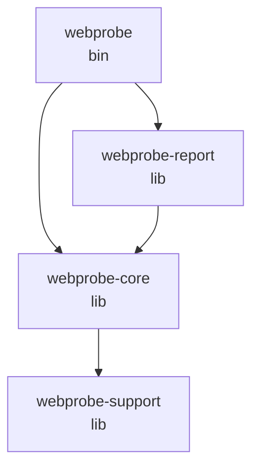

# Workspace crates

Generated by `scripts/gen-uml.sh` from `cargo metadata`. Do not edit by hand.

An arrow points from a crate to a workspace crate it depends on.

```mermaid
flowchart TD
    webprobe["webprobe<br/>bin"]
    webprobe_core["webprobe-core<br/>lib"]
    webprobe_report["webprobe-report<br/>lib"]
    webprobe_support["webprobe-support<br/>lib"]
    webprobe --> webprobe_core
    webprobe --> webprobe_report
    webprobe_core --> webprobe_support
    webprobe_report --> webprobe_core
```
