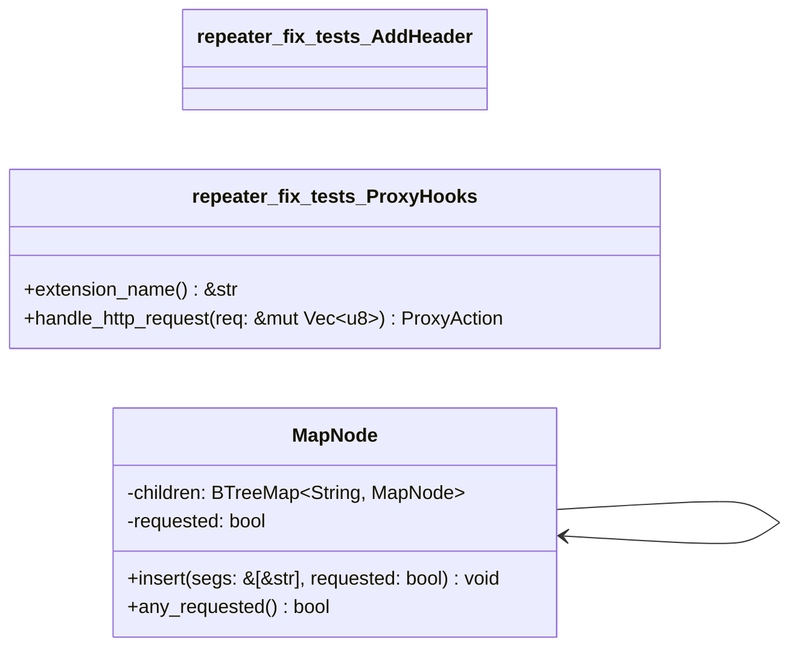

# Desktop app: UI views

Generated by `scripts/gen-uml.sh` from `app/src/ui`. Do not edit by hand.

```mermaid
classDiagram
    direction LR
    class repeater_fix_tests_AddHeader {
    }
    class repeater_fix_tests_ProxyHooks {
        +extension_name() &str
        +handle_http_request(req: &mut Vec~u8~) ProxyAction
    }
    class MapNode {
        -children: BTreeMap~String, MapNode~
        -requested: bool
        +insert(segs: &[&str], requested: bool) void
        +any_requested() bool
    }
    MapNode --> MapNode
```

